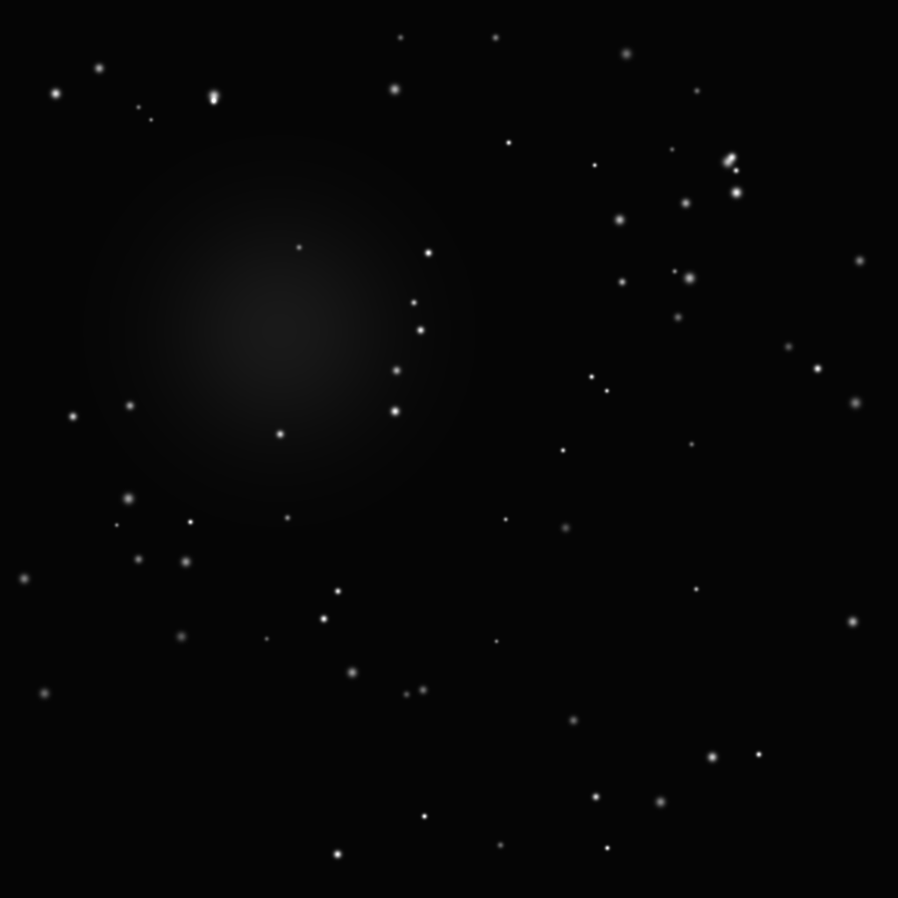
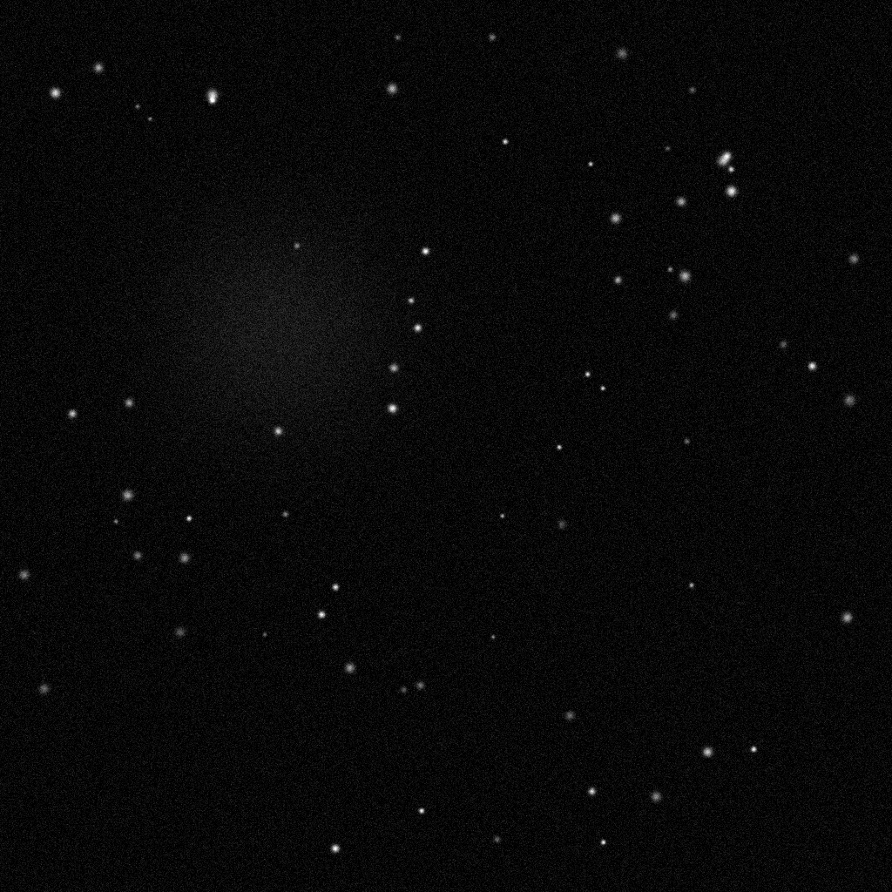

# Astronomy Frame Stacking — Eä Demo

This demo stacks N noisy exposures to reduce noise using real telescope data
from NASA SkyView (M31 / Andromeda galaxy). On first run, it auto-downloads
a DSS survey image and generates noisy exposures from it.
Falls back to synthetic starfield if download fails.

Signal reinforces linearly; noise cancels by sqrt(N). Compares two implementations:

- **NumPy** — idiomatic Python, `np.mean` over an array of frames
- **Eä** — compute kernel, compiled to shared library

Both produce identical output.

## Results

AMD Ryzen 7 1700 (Zen 1, AVX2). 1024x1024, 16 frames. 50 runs, median time.

### Performance

```
NumPy               :  33.81 ms  ±2.79
Ea f32x8 (SIMD)     :  13.15 ms  ±1.24
Ea foreach (auto)    :  13.60 ms  ±1.41
```

Eä vs NumPy: 2.6x faster.
Memory: Eä uses 16x less memory than NumPy.

### Signal-to-noise ratio

```
SNR gain: +12.03 dB from stacking 16 frames
```

## Output

| Reference | Noisy (single frame) | Stacked (16 frames) |
|---|---|---|
|  |  |  |

## The kernel

This is the entire Eä implementation. Nothing is hidden.

```
// Astronomy frame stacking: accumulate N noisy exposures, then scale.
// Signal reinforces, noise cancels by sqrt(N).
// Two kernels: accumulate (called N times), scale (called once).

// In-place accumulation: acc[i] += frame[i]
export func accumulate_f32x8(acc: *mut f32, frame: *restrict f32, len: i32) {
    let mut i: i32 = 0
    while i + 8 <= len {
        let va: f32x8 = load(acc, i)
        let vf: f32x8 = load(frame, i)
        store(acc, i, va .+ vf)
        i = i + 8
    }
    while i < len {
        acc[i] = acc[i] + frame[i]
        i = i + 1
    }
}

// Scale: out[i] = data[i] * factor
// Called with factor = 1.0 / N to compute mean.
export func scale_f32x8(data: *restrict f32, out: *mut f32, len: i32, factor: f32) {
    let vfactor: f32x8 = splat(factor)
    let mut i: i32 = 0
    while i + 8 <= len {
        let v: f32x8 = load(data, i)
        store(out, i, v .* vfactor)
        i = i + 8
    }
    while i < len {
        out[i] = data[i] * factor
        i = i + 1
    }
}
```

## Why streaming stacking?

Eä processes one frame at a time using O(pixels) extra memory for the accumulator.
NumPy loads all N frames into a single array: O(N * pixels).

For 16 frames of 1024x1024 f32:
- Eä: 4 MB (one accumulator buffer)
- NumPy: 64 MB (all frames in memory)

This matters at scale. Real astronomy pipelines stack hundreds or thousands
of exposures. Streaming keeps memory constant regardless of frame count.

## How to run

```bash
# Build compiler (once)
cargo build --features=llvm --release

# Run demo
python demo/astro_stack/run.py
```

## How it works

On first run, the script downloads a real DSS telescope image of M31 (Andromeda)
from NASA SkyView, normalizes it, and generates N noisy exposures by adding
Gaussian noise. Falls back to a synthetic starfield if the download fails.
Eä does the compute.

The kernel compiles to a `.so` and is called via `ctypes`. Python calls
`accumulate_f32x8` once per frame to sum into an accumulator buffer,
then calls `scale_f32x8` once with `factor = 1.0 / N` to compute the mean.
No allocation inside the kernel.

```bash
ea stack.ea --lib   # → stack.so
```

```python
lib = ctypes.CDLL("./stack.so")
for frame in noisy_frames:
    lib.accumulate_f32x8(acc_ptr, frame_ptr, n_pixels)
lib.scale_f32x8(acc_ptr, out_ptr, n_pixels, ctypes.c_float(1.0 / n_frames))
```
